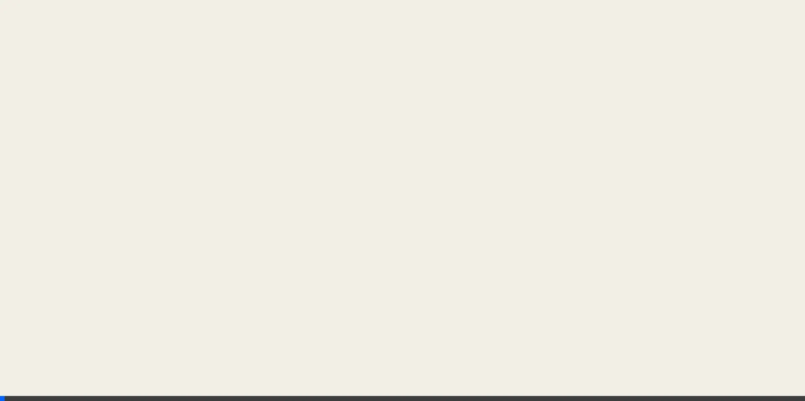
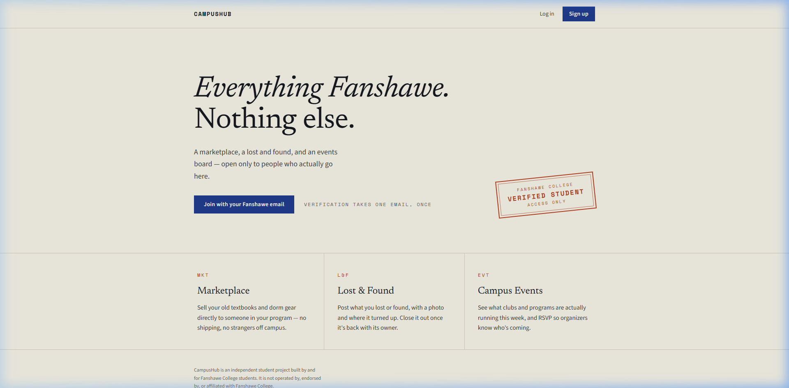
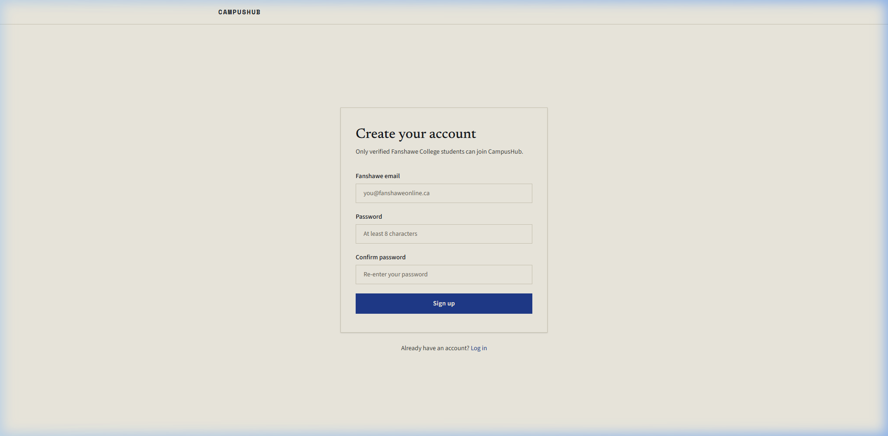
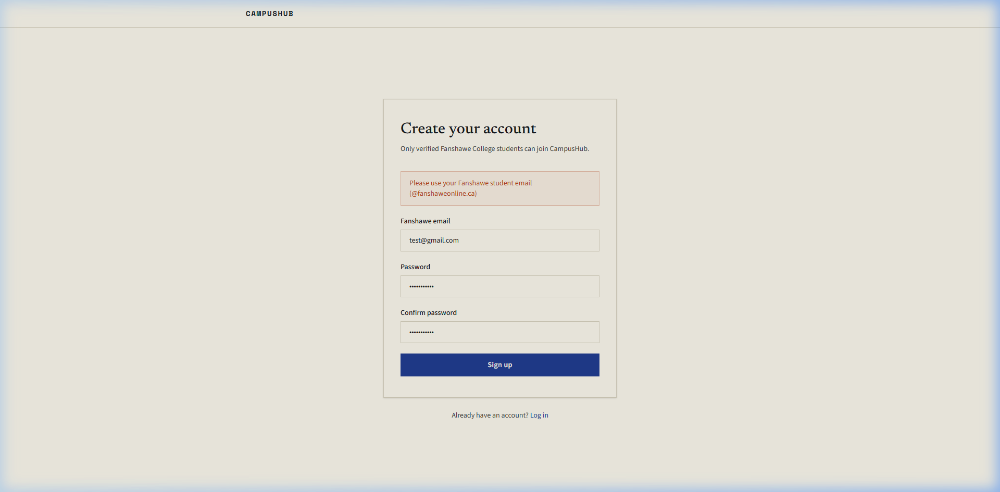
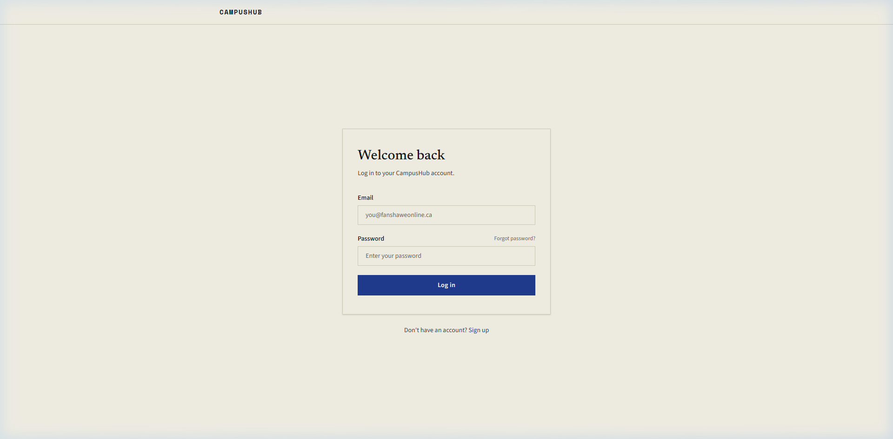
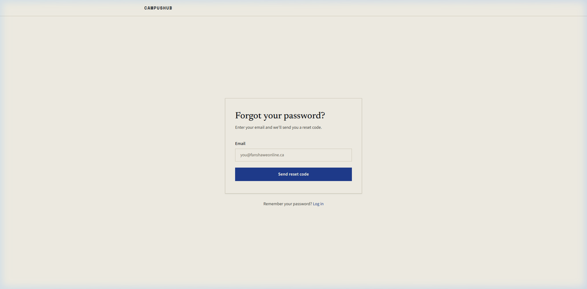
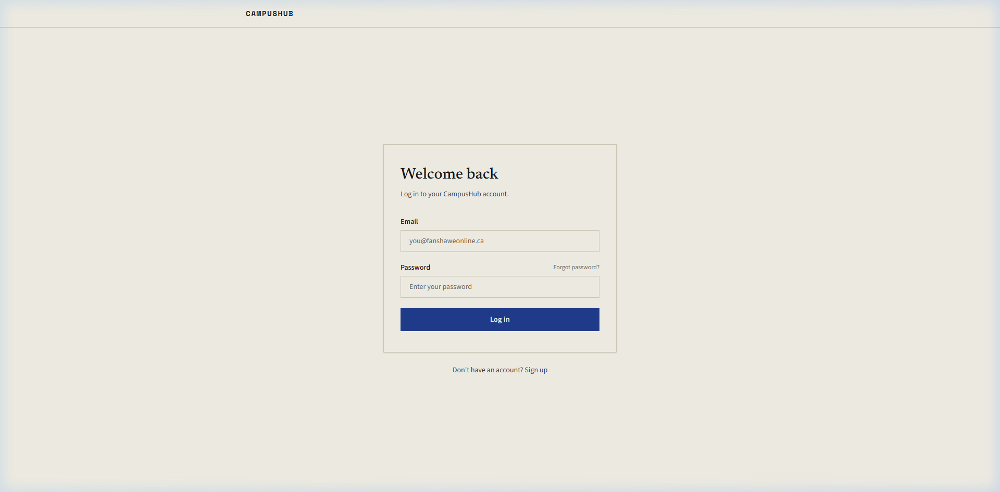

# Sprint 1 — Auth Flow Test Results

All tests passed ✅. Here's what was built and verified:

## Browser Recording

## Page Screenshots

### Landing Page
Nav shows **Log in** + **Sign up** for guests. Hero CTA: "Join with your Fanshawe email".

### Registration Page
Clean form with Fanshawe email, password, and confirm password fields.

### Email Validation
Non-Fanshawe emails (`@gmail.com`) are rejected client-side with a clear error.

### Login Page
Email + password with "Forgot password?" link.

### Forgot Password Page
Enter email to receive a reset code.

### Protected Route Redirect
Navigating to `/profile` while unauthenticated redirects to `/login` ✅

## Test Summary

| Test | Result |
|---|---|
| Landing page renders | ✅ |
| Nav shows guest links (Log in / Sign up) | ✅ |
| Hero CTA links to /register | ✅ |
| Registration page renders | ✅ |
| Non-Fanshawe email rejected | ✅ |
| Login page renders | ✅ |
| Forgot password page renders | ✅ |
| `/profile` redirects to `/login` when unauthenticated | ✅ |
| API typechecks clean | ✅ |
| Web typechecks clean | ✅ |
| API builds clean | ✅ |
| Web builds clean | ✅ |
| Prisma schema pushed to MongoDB Atlas | ✅ |
