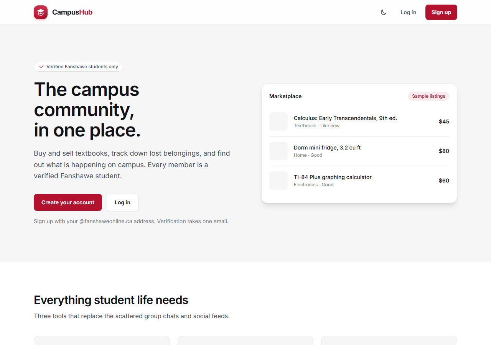
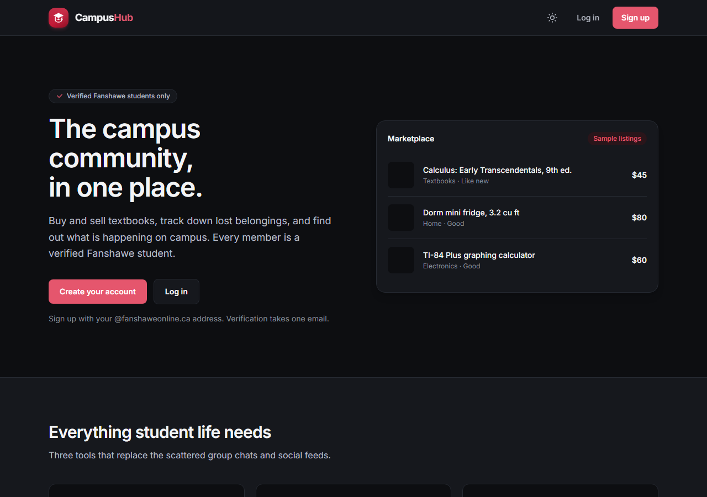
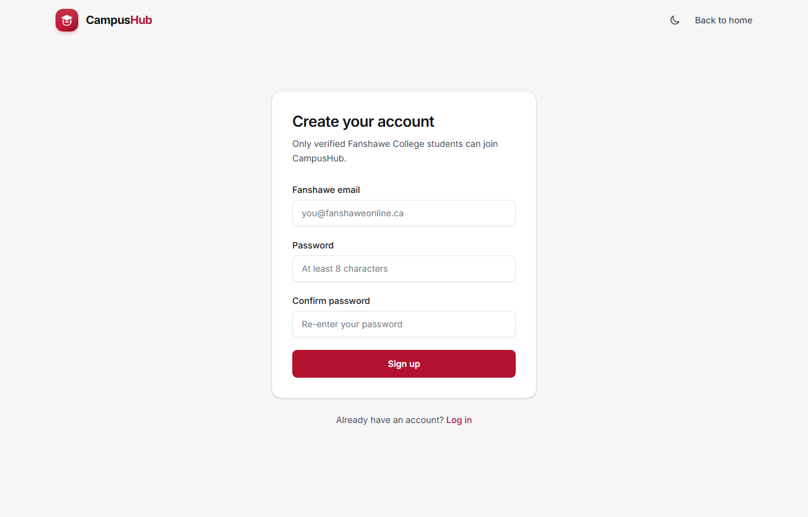
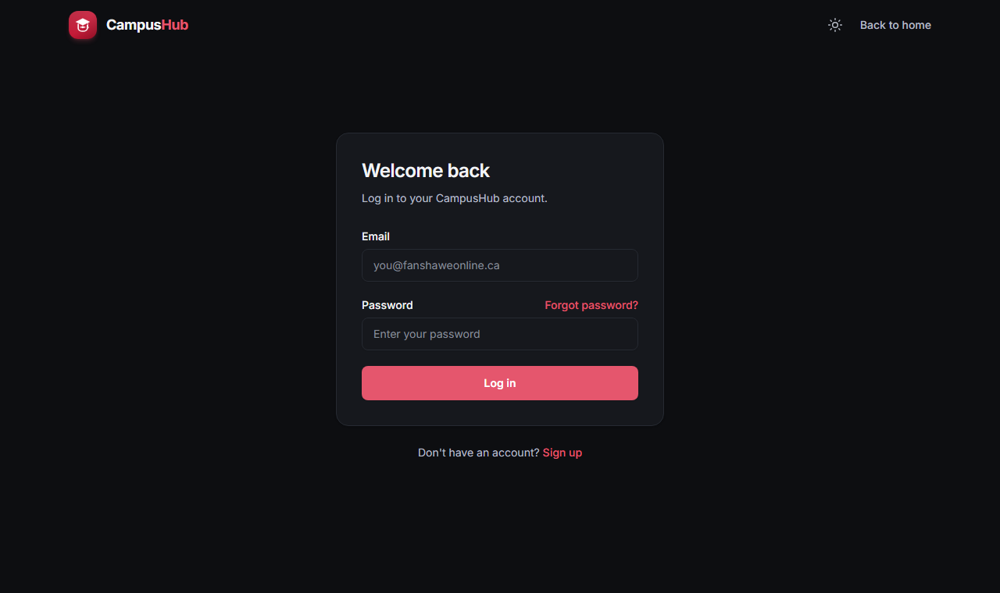
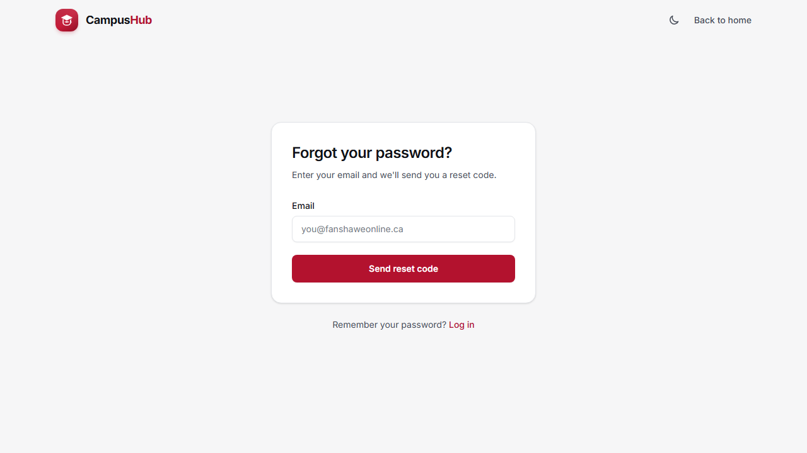
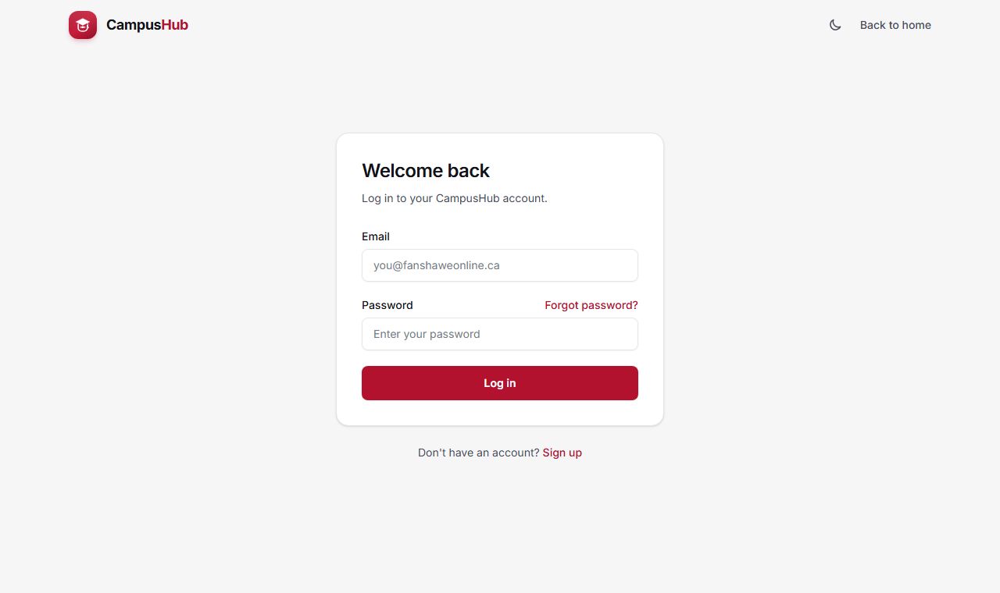

# Sprint 1: Auth Flow Walkthrough

Final state of the Sprint 1 UI (accounts and verification), shown in light and dark mode.
Use the sun/moon button in the header to switch themes.

## Landing Page
Guests see **Log in** and **Sign up** in the nav. The hero CTA is "Create your account".

| Light | Dark |
|---|---|
|  |  |

## Registration
Fanshawe email, password, and confirm password. Non-Fanshawe emails are rejected on both the client and the server.

## Login
Email and password with a "Forgot password?" link.

| Light | Dark |
|---|---|
|  |  |

## Forgot Password
Enter an email to receive a reset code. The response is the same whether or not the account exists.

## Protected Route
Opening `/profile` while logged out redirects to `/login`.

## Test Summary

| Test | Result |
|---|---|
| Landing page renders (light and dark) | ✅ |
| Nav shows guest links | ✅ |
| Theme toggle switches and persists | ✅ |
| Hero CTA links to /register | ✅ |
| Registration page renders | ✅ |
| Non-Fanshawe email rejected | ✅ |
| Login page renders | ✅ |
| Wrong credentials return a generic error | ✅ |
| Forgot password page renders | ✅ |
| `/profile` redirects to `/login` when unauthenticated | ✅ |
| API typechecks and builds | ✅ |
| Web typechecks and builds | ✅ |
| Prisma schema pushed to MongoDB Atlas | ✅ |
